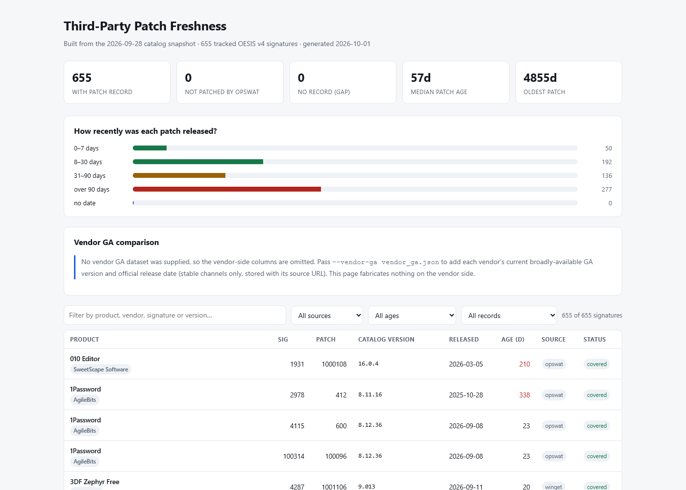
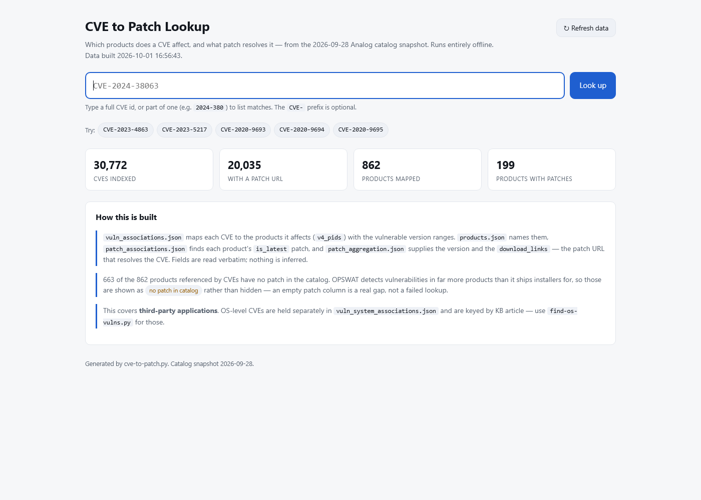
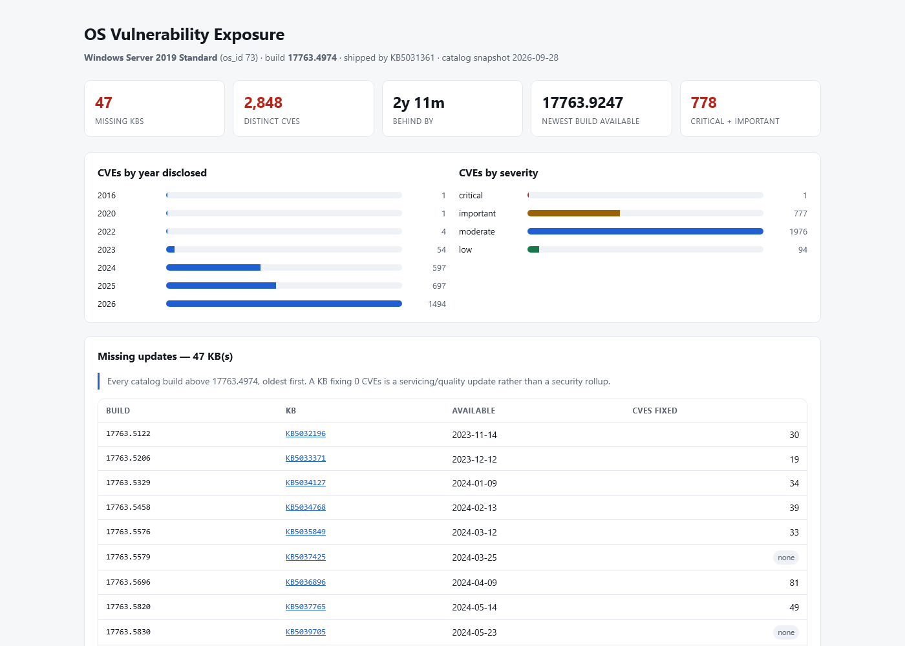

# Catalog Lookup

Quick command‑line lookups against the OPSWAT **Analog** offline catalog
(`OPSWAT-SDK/extract/analog/server/*.json`). Each script finds the catalog automatically by
walking up for the `sdkroot` marker, so run them from anywhere in the repo.

> Run the SDK downloader first so `OPSWAT-SDK/extract/analog/server` exists.

## HTML views

Self-contained pages built from the catalog snapshot. Everything is inlined, so they open in any
browser with no server and no network — hand one to a colleague and it just works.

### Third-Party Patch Freshness
*Generated by* `build-patch-freshness-page.py [--signatures FILE] [--vendor-ga JSON] [--out PATH]`

**How current is each patch?** For every tracked signature the page answers *when did OPSWAT last
update its third-party patch for this product*. For each signature it shows the patch id, the
**catalog version**, the **release date**, the **age in days**, the data **source**
(`opswat`/`winget`) and a status. Summary tiles and an age histogram sit above a searchable,
filterable table (by product/vendor/signature/version, by source, by age band).
```
python build-patch-freshness-page.py                                  # every signature → patch-freshness.html
python build-patch-freshness-page.py --signatures my-sigs.txt         # only the signatures you track
python build-patch-freshness-page.py --vendor-ga vendor_ga.json       # add vendor-side GA columns
python build-patch-freshness-page.py --out reports/freshness.html     # choose the output path
```
It also prints the same summary to the console, which is the quick way to use it:
```
Catalog snapshot : 2026-09-28
Tracked signatures : 655
  with patch record   : 655
  gaps (no record)     : 0
  median patch age     : 57 days (newest 2d, oldest 4855d)
  source opswat        : 579      source winget : 76
```

<a href="docs/patch-freshness-page.png">
  
</a>

<sub>The generated page — summary tiles, age histogram, then the filterable table. Click to view full size.</sub>

**What the status column separates.** `products.json` → `support_3rd_party_patch` is used to tell
*"OPSWAT does not patch this product"* apart from *"no patch record found"*, so a product OPSWAT
never claimed to patch is not reported as a gap.
> **The gap figures only mean something with `--signatures`.** With no list, the tracked set *is*
> every signature that has a patch association — so "not patched by OPSWAT" and "no record (gap)"
> are always 0 by construction, not a measured result. Pass the signatures you actually care about
> (for example, everything detected across your endpoints) to see real gaps. Note that the SDK can
> detect signatures that are absent from `products.json` entirely; those report as gaps.

**Input formats.**
- `--signatures FILE` — signature ids one per line or comma-separated; `#` starts a comment.
  ```
  # endpoints, week 40
  3241, 41
  2087      # BitTorrent
  ```
- `--vendor-ga JSON` — keyed by signature id or exact product name:
  ```json
  {"generated": "2026-10-01",
   "products": {"Google Chrome": {"version": "141.0.7390.55",
                                  "release_date": "2026-09-30",
                                  "source_url": "https://chromereleases.googleblog.com/..."}}}
  ```

**Vendor GA columns are opt-in and never fabricated.** Without `--vendor-ga` the page says so and
omits them. The JSON supplies each vendor's current broadly-available version and official release
date (stable channels only, each stored with its source URL) — so "catalog version vs what the
vendor actually ships" is a comparison you supply evidence for, not one the page invents.

The join: `patch_associations.json` (signature → the `is_latest` patch) → `patch_aggregation.json`
(`product_name`, `latest_version`, `release_date`) and `patch_aggregation_v2.json` (same patch in
v2 shape, where the signature mapping is inline on `product.v4_signatures` and the field is
`version`). `products.json` supplies names and the patch-support flag. Nothing else in the snapshot
is opened.
> Age is measured from the catalog's own `release_date`, so it reflects **when the vendor shipped
> that version**, not when OPSWAT ingested it. A large age usually means the product itself has not
> been updated — check a long tail against the vendor before reading it as an OPSWAT gap.

### CVE to Patch Lookup
*Generated by* `cve-to-patch.py --html [PATH]` *(default `cve-to-patch.html`), or served live with* `--serve`

**Which products does a CVE affect, and what patch resolves it?** The page carries **every CVE in
the catalog** — 30,772 indexed across 862 products at the September 2026 snapshot — so any of them
can be looked up offline with no server. Type a full or partial CVE id; partial lists matches to
pick from. Deep-links work: `cve-to-patch.html#CVE-2023-4863` opens straight to that CVE.

<a href="docs/cve-to-patch-lookup.png">
  
</a>

<sub>Search, index tiles, and a panel stating exactly which catalog files produced the answer.</sub>

Served with `--serve` (default port 8765) the **Refresh data** button runs a staged workflow —
fetch (if `--update-cmd` is set), read `products.json`, read the patch files, read
`vuln_associations.json`, rebuild the index — then swaps the new data in and re-renders, keeping
your current search. A failed stage is named, and the previously loaded data is kept rather than
blanked. `--update-cmd "CMD"` is what makes it load *updated* values: the command runs first (your
SDK downloader, a sync script), and the workflow aborts with its error if it fails.
> Opened as a plain file the button can only reload the file itself — a browser cannot read the
> catalog JSON over `file://`. Regenerate with `--html`, or use `--serve` for a live refresh.

See [`cve-to-patch.py`](#cve-to-patchpy-cve---html-path--which-products-have-a-cve-and-the-patch-that-fixes-it)
under Scripts for the command-line lookup and the full join.

### OS Vulnerability Exposure
*Generated by* `find-os-vulns.py <os_id|name> <build> --html PATH` *(pair with* `--details` *for severity and CVSS)*

**What is one Windows build still exposed to?** Exposure cards (missing KBs, distinct CVEs, how far
behind, newest build available), CVEs by year disclosed and by severity, the missing-KB timeline
with what each KB fixes, and a sortable, searchable CVE table linking each CVE to NVD and to the KB
that resolves it. The title carries the OS and build, so a page is self-describing once saved.

<a href="docs/os-vulnerability-exposure.png">
  
</a>

<sub>Windows Server 2019 at build 17763.4974 — 47 missing KBs covering 2,848 CVEs, 2y 11m behind.</sub>

> A KB fixing 0 CVEs is a servicing/quality update rather than a security rollup, and is labelled
> as such rather than dropped.

See [`find-os-vulns.py`](#find-os-vulnspy-os_idname-build--what-is-a-windows-build-vulnerable-to)
under Scripts for the command-line output and why the delta is computed this way.


## Scripts

### `find-kb.py <KB> [--no-size]` — is a KB supported?
Searches `kb_info.json` across every OS section and reports, per OS: the build(s) that contain
the KB, whether it's in the supersedence tree (and cumulative), what it supersedes, and the CVEs
it remediates. Then shows **release details** (`patch_system_aggregation.json`): title, **release
date**, severity, category, reboot flag, **description**, KB‑article link, and each download
per architecture with its **URL, SHA1 hash, and file size**.
```
python find-kb.py 5094127
python find-kb.py KB5094127
python find-kb.py 5041580 --no-size    # skip the live download-size lookup (offline)
```
> Size is not stored in the catalog, so it's fetched live via an HTTP HEAD to the download URL.
> Use `--no-size` to skip that when offline or when you only need the catalog fields.

### `find-cve.py <CVE>` — CVE details + patches (with release details) + CPEs
Shows `cves.json` details (CWE, **severity**, **CVSS vector/score**, published date, **description**),
then the **corresponding patches** with **release details**:
- **OS KB(s)** by OS (`kb_info.json`) — each with its **release title, release date, severity,
  category, reboot flag, KB‑article/release‑note link, and download link**
  (`patch_system_aggregation.json`).
- **3rd‑party** affected product(s) with the **version to upgrade to** and **release notes**
  (`patch_associations` + `patch_aggregation`), plus vulnerable version ranges.
- Associated **CPEs** (`vuln_associations.json`).
```
python find-cve.py CVE-2024-38063
```
*(cves.json is large — the first lookup takes a few seconds to load it.)*

### `find-signature.py <application name>` — name → signature id
Given an application name (or any part of one), returns the matching product **signature id(s)**
from `products.json` (matches product name, signature names, and marketing names). Pair the
result with `find-patch-for-signature.py`.
```
python find-signature.py chrome
python find-signature.py ".net runtime"
python find-signature.py "visual studio 2022"
```

### `find-patch-for-signature.py <signature_id>` — patch/installer for a product signature
Shows the product/vendor a signature identifies (`products.json`) and the patch association(s)
(`patch_associations.json`) with the latest available version, release notes, and each download
(`patch_aggregation.json`) with its **URL and SHA256 hash**.
```
python find-patch-for-signature.py 41       # Google Chrome
python find-patch-for-signature.py 3880     # Microsoft .NET Runtime 8.0 x64
```

### `find-os-vulns.py <os_id|name> <build>` — what is a Windows build vulnerable to?
Given an OS and its installed build (e.g. `17763.4974` from `10.0.17763.4974`), lists every
catalog build **newer** than the installed one, the **KB** that ships it, when it became
available, and the **CVEs those missing KBs remediate**.
```
python find-os-vulns.py 73 10.0.17763.4974          # Windows Server 2019 Standard
python find-os-vulns.py "Server 2019 Standard" 17763.4974
python find-os-vulns.py 73 17763.4974 --list-cves   # every CVE id
python find-os-vulns.py 73 17763.4974 --details     # + severity/CVSS (loads cves.json, slow)
python find-os-vulns.py 73 17763.4974 --details --html os-vulns.html   # HTML summary
```
Nothing in the catalog is keyed *"OS version → CVE list"*. The shipped
`sample_code/get_system_vuln.rb` query is keyed by **KB article + os_id** and returns the CVEs
that *one KB* fixes — and OPSWAT marks that path *"Not recommended"* for Windows. `kb_info.json`
does map `build → kb_articles` and `kb → cves`, so the CVEs a build is still exposed to are those
fixed by KBs in **higher builds**. That delta is read verbatim from the catalog, not inferred.
`--html PATH` also writes a self-contained page — see **OS Vulnerability Exposure** under
[HTML views](#html-views).

> For production Windows assessment OPSWAT recommends **WIV.dat + WUO.dat** at runtime instead of
> the KB-article query. Use this script for offline/catalog-side analysis and reporting.

### `cve-to-patch.py [CVE] [--html PATH]` — which products have a CVE, and the patch that fixes it
Given a CVE, lists every affected product (`vuln_associations.json` → `v4_pids`) with its
**vulnerable version ranges**, platform, the **version that fixes it**, and the **patch download
URL** that resolves it. `--html` and `--serve` build the searchable page — see **CVE to Patch
Lookup** under [HTML views](#html-views).
```
python cve-to-patch.py CVE-2023-4863
python cve-to-patch.py 2023-4863                    # CVE- prefix optional
python cve-to-patch.py --html cve-to-patch.html     # build the searchable page
python cve-to-patch.py --serve                      # serve it with the Refresh workflow
python cve-to-patch.py --serve --update-cmd "..."   # fetch new catalog files first
```
Signatures are shown as **`Signature Name: #id`** (e.g. `Microsoft Office 2019: #3242`). A
signature's own name is more specific than its product's — signature 3242 is named *Microsoft
Office 2019* while its product is *Microsoft Office C2R* — so the signature name is used.

The join: `vuln_associations.json` (cve → `v4_pids` + ranges + `os_type`) → `products.json`
(names, vendor, signature ids) → `patch_associations.json` (the `is_latest` patch, by `v4_pid` or
by signature) → `patch_aggregation.json` / `_v2.json` (`latest_version`, `download_links`,
`release_note_link`). Fields are read verbatim.
> Roughly **two thirds of the products referenced by CVEs have no patch in the catalog** — OPSWAT
> detects vulnerabilities in far more products than it ships installers for. Those are reported as
> *no patch in catalog* rather than hidden, so a gap is never mistaken for a failed lookup.
> This covers **third-party applications**; OS-level CVEs live in `vuln_system_associations.json`
> and are keyed by KB article — use `find-os-vulns.py` for those.

### `find-cpe.py <cpe or substring>` — what a CPE maps to
Searches `vuln_associations.json` for matching CPE strings and shows the product(s)/signature(s)
they belong to and the CVEs associated with each.
```
python find-cpe.py cpe:/a:microsoft:.net
python find-cpe.py "google:chrome"
```

### `find-patch.py <patch_uuid>` — OS patch by patch UUID
Looks up a patch in `patch_system_aggregation_v2.json` and shows its KB, bulletin id(s), data
source, and every **package** (architecture variant) it contains — each with title, release
info, download **URL + SHA1**, and applicable OS list.
```
python find-patch.py 1f1b6061-3355-4ba6-ac92-5f4e625e2cc0
```

### `find-package.py <package_uuid>` — OS patch package by package UUID
Finds a single package and shows its detail plus the **parent patch** it belongs to
(patch UUID, KB, bulletin id(s)).
```
python find-package.py 50babee7-7339-4c3a-9e75-e6adc041e66c
```

### `find-bulletin.py <bulletin id or substring>` — patches for a bulletin
Finds the patch(es) tied to a security bulletin (e.g. `MS22-0110-5009497`, or a substring like
`MS22-0110` or `5009497`) and lists the patch UUID, KB, and packages for each.
```
python find-bulletin.py MS22-0110-5009497
python find-bulletin.py 5009497
```

### `list-supported-apps.py [--source winget|opswat]` — all patchable apps
Lists every supported third-party application the catalog can patch (`patch_aggregation_v2.json`),
showing each app's **latest version, signature(s), and source** (`opswat` = OPSWAT‑verified, or
`winget`), with a **total patch count, a unique‑application count, and a per‑source breakdown**
(patches + unique apps) at the end. `--source` filters to one source.
```
python list-supported-apps.py
python list-supported-apps.py --source winget
```

### `list-patches.py <signature_id> [--json] [--latest]` — every version of an app, with packages
Given a product signature id, lists **every** 3rd‑party patch (version) in `patch_aggregation_v2.json`
for that product, oldest first, with the install flags (`requires_close_first` / `requires_uninstall_first`
/ `requires_restart`) and **every package** under each: `package_uuid`, architecture, **SHA256, download
link** and `is_rollback_target`. Tags the current version `LATEST` and approved rollback versions
`ROLLBACK TARGET`.
```
python list-patches.py 3241            # Notepad++ x64: 6 versions, 12 packages
python list-patches.py 3241 --latest   # just the current version
python list-patches.py 3241 --json     # machine-readable
```
> This is the lookup the endpoint SDK does not provide: `GetPackages` (50306) needs a `patch_uuid`
> and `GetLatestInstaller` (50300) returns only the latest version, so nothing on the endpoint turns
> a signature into its set of versions. The `--json` output is shaped the way a `GetPatches(signature)`
> call would return it — `{signature, product, patches:[{patch_uuid, version, release_date, is_latest,
> is_rollback_target, packages:[...]}]}`. Pair with `find-signature.py` to get the id.

### `list-rollback-targets.py [--json]` — apps that can be rolled back
Lists every application with an OPSWAT‑approved **rollback target** — a package flagged
`is_rollback_target` in `patch_aggregation_v2.json` — showing the **latest** version, the version it can
be **rolled back to**, the qualifying **architectures** and **signatures**, and the vendor. 12 of 469
patchable products at the time of writing.
```
python list-rollback-targets.py
python list-rollback-targets.py --json
```
> A rollback target is the one earlier version OPSWAT approved, not necessarily the previous release
> (Claude's is a 1.x build behind a 2.x latest), and eligibility is per architecture (Notepad++ 8.9.6.4
> is a target for x86/x64 but not arm64). The endpoint SDK has no call that exposes this flag —
> `helloworld/python/rollback.py` reads it from the same file.

### `catalog-counts.py` — catalog-wide totals
Prints a census of the whole catalog: applications (unique products + total signatures, **how
many have vulnerability detection** = a CVE mapping, and patchable apps), **BIOS / Driver /
Firmware patch counts** (driver_firmware_patch_aggregation.json), unique KBs, unique CVEs
(cves.json + those referenced by mappings), and total CVE mappings (OS + 3rd-party). The summary
lists total and unique applications, patchable applications, and driver/firmware/BIOS totals.
```
python catalog-counts.py
```
> Reads the large `cves.json` (~188 MB) and `vuln_system_associations.json` (~670 MB); the CVE
> section takes a minute or two and a few GB of RAM.

## Data sources
| File | Used for |
|---|---|
| `kb_info.json` | KB supersedence / build / KB→CVE (find-kb, find-cve OS patches, find-os-vulns) |
| `cves.json` | CVE metadata (find-cve) |
| `vuln_associations.json` | 3rd‑party CVE ↔ product ↔ CPE + vulnerable version ranges (find-cve, find-cpe, cve-to-patch) |
| `products.json` | signature/product/vendor names; `support_3rd_party_patch` (build-patch-freshness-page) |
| `patch_associations.json` + `patch_aggregation.json` | signature → patch → latest version/downloads/release notes; patch release dates and age (build-patch-freshness-page) |
| `patch_aggregation_v2.json` | supported third-party apps: latest version, signature(s), source (opswat/winget) (list-supported-apps); every version + package per signature (list-patches); `is_rollback_target` (list-rollback-targets) |
| `driver_firmware_patch_aggregation.json` | BIOS / driver / firmware patch counts by component and vendor (catalog-counts) |
| `patch_system_aggregation_v2.json` | OS patch release details (title, date, severity, KB article, download URL+SHA1) and patch/package/bulletin lookups — used by find-kb, find-cve, find-patch, find-package, find-bulletin |
| `os_info.json` | os_id → OS name |

_Created by Chris Seiler — OPSWAT OEM Field CTO_
